# Olá 👋, Eu sou Kayque Miqueias

🚀 **Dev Full-Stack | JavaScript & Python**

Eu construo **aplicações escaláveis**, **API's seguras com autenticação** e **sistemas web** de alta performance.
Estou profundamente focado em **arquitetura, performance, código limpo e soluções orientadas a negócios**.

---

## 🌐 Onde me encontrar

---

## 🧠 O que eu faço

-   🏗️ Sistemas Web e Apps Mobile
-   🧩 Arquitetura limpa
-   🔐 APIs seguras e autenticação

---

## 🛠️ Tecnologias Utilizadas

### Frontend

### Backend

### DevOps & Tools

---

  

## 🚀 Filosofia

> _"Programar não é apenas resolver problemas. 
> É construir soluções que escalem, perdurem e gerem valor real."_
